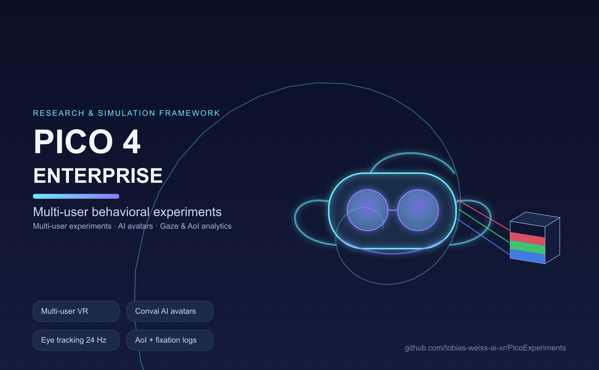
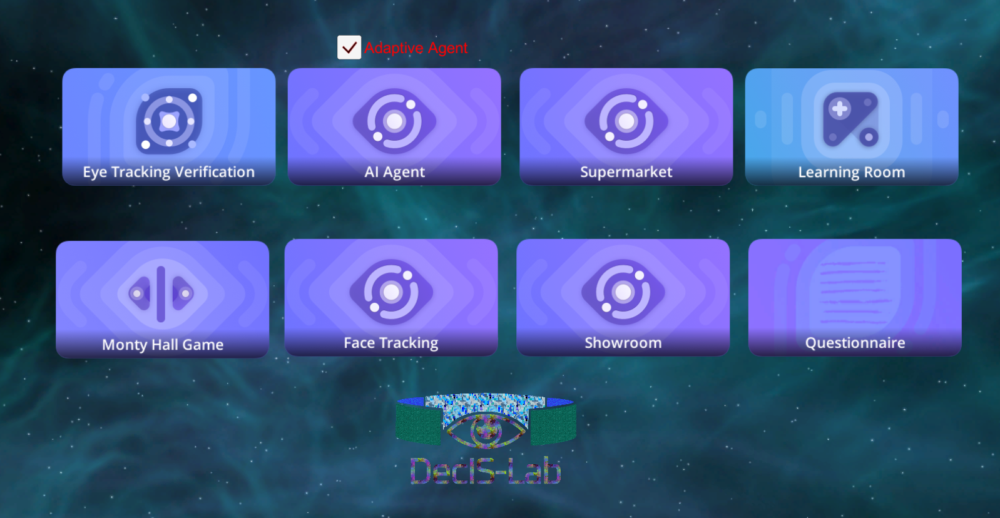

# PICO 4 Enterprise VR Research & Simulation Framework

A research and simulation framework for behavioral experiments on the PICO 4
Enterprise HMD: multi-user VR scenes, AI avatars, and integrated data logging
for gaze, areas of interest, and user interaction.

## Framework capabilities

- **Multi-user VR** (Normcore): shared avatars, synchronized dashboards and shop
  interactions (checkout UI, doors, spawnable objects)
- **AI sales avatars** (Convai): speech-driven agents, e.g. a 3D-printer sales
  consultant in the showroom scene; face tracking and lip sync on device
- **Eye & face tracking on PICO**: 24 Hz eye-gaze recording, fixation/saccade
  event detection, and a UDP client that streams gaze events to an external
  classifier
- **Head-raycast AoI tracking** for scenes without eye tracking (desktop editor
  runs and HMDs without eye tracking): areas of interest, dwell times, fixations
  - see [Feature-Map Raycast AoI Demo](#feature-map-raycast-aoi-demo)
- **CSV research data logging**: every session writes timestamped CSVs to
  `Recordings/` (editor: project root, build: app files dir); Unix epoch-ms
  timestamps make all streams alignable
- **Desktop testing**: StarterAssets first-person rig runs the scenes in the
  editor without a headset

## Simulation & experiment scenes

- `00_Menu` — main menu / lobby
- `Supermarket` — multi-user shopping environment with AI agent
- Car showroom (`showroom-tank-car-plane`) — product presentation with
  switchable exhibits
- 3D-printer showroom — AI sales avatar consultation
- Monty Hall Game — decision-making task
- Immersive VR questionnaire
- `ObjectTracking` (formerly `ProductSpawnV2`) — feature-map raycast AoI demo
- and more...

## Feature-Map Raycast AoI Demo

A head-mounted-display raycast demo that does **not** require eye tracking
(scene: `Assets/Scenes/ObjectTracking.unity`, formerly `ProductSpawnV2`).

- `FeatureMapRaycaster.cs` casts a ray from the camera root (`PlayerCameraRoot`, 20 m) each frame.
- Hits on objects using the `Universal Render Pipeline/FeatureMap` shader (`Assets/Scripts/FeatureMap.shader`)
  are resolved to a texel in the material's `_FeatureMap` texture. The texel color encodes the
  area of interest: red = *Details*, green = *Advertisement*, blue = *Logo*.
- `FeatureMapDisplay.cs` subscribes to the `OnFeatureMapColor` event and shows the label on a TMP text.

### AoI logging

The raycaster logs each session to three CSVs in `Recordings/` (editor: project root;
build: app files dir). Filenames: `<date>-<participantId>-<scene>-aoi*.csv`, unique per run.
Set `participantId` on the raycaster component per participant.

| File | Columns | Content |
|---|---|---|
| `…-aoi.csv` | `StartEpochMs;LogTime;DurationInSec;Area;HitObject` | one row per area interval, transitions only |
| `…-aoi-raw.csv` | `EpochMs;LogTime;Area` | committed area sampled at 10 Hz for post-hoc re-analysis |
| `…-aoi-fixations.csv` | `StartEpochMs;EndEpochMs;DurationInSec;Area` | fixations: gaze stable (< 50°/s) ≥ 100 ms on an area |

Signal processing, tuned via inspector fields on the raycaster:

- **Debounce** (`minDwell`, 100 ms): an area must hold this long before a switch commits —
  kills texel-noise flicker at area borders.
- **Border hysteresis** (`probeSpread`, 0.03): before committing, a 5-ray cross (center + 4 probes)
  must confirm the new area with ≥ 4/5 votes; otherwise the dwell hold restarts. A ray straddling
  a border splits its probes and never flips the committed area. Rationale and tuning:
  `docs/specs/2026-10-08-aoi-tracking-design.md`.
- **Fixations** (`saccadeVelocity` 50°/s, `minFixationDuration` 100 ms): angular-velocity saccade
  detection splits fixations; sub-threshold sweeps are discarded.

Timestamps are Unix epoch ms (alignable with the eye-tracking CSVs) plus local wall-clock strings.
Rows are flushed per write. Design rationale: `docs/specs/2026-10-08-aoi-tracking-design.md`.

- `FeatureMapSpawner.cs` instantiates the demo box (`Resources/FeatureMapDemo/DemoBox`) and assigns the
  feature map at runtime; the texture needs *Read/Write Enabled* (already set in its `.meta`).

## Setup

- Open Unity, switch to the Android platform, and build the APK for the PICO 4 Enterprise.
- Multi-user scenes need Normcore app credentials configured.

## Log locations

- Editor: `Recordings/` in the project root, plus the Unity Console
  (`%LOCALAPPDATA%\Unity\Editor\Editor.log`)
- On device: `adb logcat -s Unity` for logs; research CSVs under
  `Android/data/<package>/files/Recordings/` (pull with `adb pull`)

## Face Tracking

To enable Face Tracking, you need to pick a Face Tracking Mode on PXR_Manager.

Hybrid: Enable face tracking and lipsync. Uses all 52 blend shapes and 20 visemes.

Face Only: Enable face tracking only. Uses all 52 blend shapes.

Lipsync Only: Enable lipsync only. Uses all 20 visemes.

## Inverse Kinematics

### Howto Animated

- Arms: https://www.youtube.com/watch?v=tBYl-aSxUe0
- Legs: https://youtu.be/W2_MtYSPaM
- Walk: https://youtu.be/8REDoRu7Tsw

- New Version: https://www.youtube.com/watch?v=v47lmqfrQ9s&t=200s

### Howto Sinoid

- Part 1: https://www.youtube.com/watch?v=MYOjQICbd8I
- Part 2: https://www.youtube.com/watch?v=1Xr3jB8k1g

# Readyplayerme hints
- Right morph targets and quality: https://models.readyplayer.me/649716ff38ad7f783a122407.glb?quality=low&textureAtlas=none&morphTargets=ARKit,Oculus%20Visemes,mouthSmile
- Comparison with VR upper-half avatars as possible extension: https://vr.readyplayer.me/

Failed API-Calls:
- No morph targets: https://models.readyplayer.me/649716ff38ad7f783a122407.glb?quality=high?morphTargets=ARKit,Oculus%20Visemes
- Wrong morph targets: https://models.readyplayer.me/649716ff38ad7f783a122407.glb?quality=low&morphTargets=ARKit,Oculus%20Visemes
